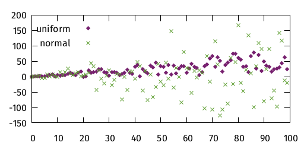
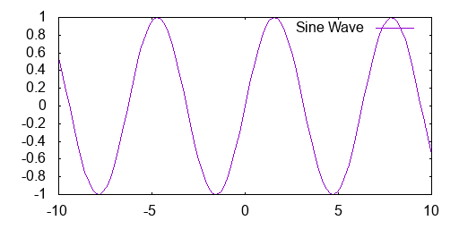
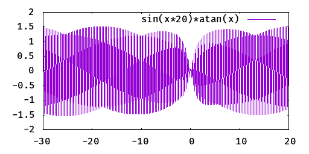
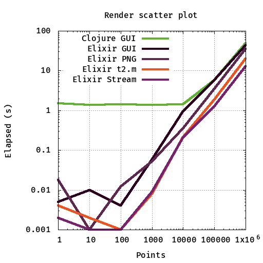

# Gnuplot Elixir

A simple interface from [Elixir data][7] to the [Gnuplot graphing utility][1] that uses [Erlang Ports][5] to transmit data from your application to Gnuplot. Datasets are streamed directly to STDIN without temporary files and you can plot [1M points in 12.7 seconds](examples/stress.exs).

Please visit the [Gnuplot demos gallery](http://gnuplot.sourceforge.net/demo/) to see all the possibilities, the [manual which describes the grammar](http://www.gnuplot.info/docs_5.2/Gnuplot_5.2.pdf), and the [examples folder](examples/).

This is a conversion of the [Clojure Gnuplot library][4] by [aphyr][2]. This library can also be [called from Erlang](docs/erlang.md) and has been tested on OS X, Ubuntu 16.04 and CentOS 7.6.

[](https://travis-ci.org/devstopfix/gnuplot-elixir)
[](https://hex.pm/packages/gnuplot)
[](https://hexdocs.pm/gnuplot/Gnuplot.html)


## Usage

The `plot` function takes two arguments:

* a list of commands (each of which is a list of terms)
* a list of Streams or Enumerable datasets (not required when plotting functions)

Commands are lists of terms that normally start with an atom such as `:set`. They may be written as lists or [Word lists](https://elixir-lang.org/getting-started/sigils.html#word-lists) - the following lines are equivalent:

* `[:set, :xtics, :off]`
* `~w(set xtics off)a`

and both convert to `set xtics off`.

Strings are output inside double quotes, and charlists are output without modification. `[:plot, 'sin(x)', :title, "Sine Wave"]` becomes: `plot sin(x) title "Sine Wave"`

A dataset is a list of points, each point is a list of numbers. A dataset can be a Stream.

### Scatter plot with a single dataset

Lets compare the distributions of the [Erlang rand functions](http://erlang.org/doc/man/rand.html):

```elixir
alias Gnuplot, as: G

dataset = for _ <- 0..1000, do: [:rand.uniform(), :rand.normal()]
{:ok, _cmd} = G.plot([
  [:set, :title, "rand uniform vs normal"],
  [:plot, "-", :with, :points]
  ], [dataset])
```

Gnuplot will by default open a window containing your plot:


The command string sent (`_cmd` above) can be manually inspected should the chart not appear as you expected.

### PNG of two datasets

Write two datasets to a PNG file:

```elixir
{:ok, _cmd} = G.plot([
  [:set, :term, :png], 
  [:set, :output, "/tmp/rand.png"]
  [:set, :title, "rand uniform vs normal"],
  [:set, :key, :left, :top],
  [:plot,
    G.list(
      ["-", :title, "uniform", :with, :points],
      ["-", :title, "normal", :with, :points])]
  ],
  [
        for(n <- 0..200, do: [n, n * :rand.uniform()]),
        for(n <- 0..200, do: [n, n * :rand.normal()])
  ])
```



NB When we are plotting multiple datasets in the same plot we need a comma separated list for the `plot` command which is made here with `G.list([ [...], [...], ... ])`


### Plot functions without datasets

```elixir
G.plot([[:plot, 'sin(x)', :title, "Sine Wave"]])
```



```elixir
G.plot([
        ~w(set autoscale)a,
        ~w(set samples 800)a,
        [:plot, -30..20, 'sin(x*20)*atan(x)']
])
```

NB [ranges](https://hexdocs.pm/elixir/Range.html) can be used



## Installation

This library is [available in Hex](https://hex.pm/packages/gnuplot), the package can be installed
by adding `gnuplot` to your list of dependencies in `mix.exs`:

```elixir
def deps do
  [
    {:gnuplot, "~> 1.19.88"}
  ]
end
```

Documentation can found at [hexdocs.pm/gnuplot](https://hexdocs.pm/gnuplot/Gnuplot.html).

## Testing

Some tests create plots which require `gnuplot` to be installed. They can be be excluded with:

    mix test --exclude gnuplot:true

## Performance

The performance of the library on a MacBook Air is comparable to the Clojure version when `gnuplot` draws to a GUI. It is a little faster when writing directly to a PNG when running on a server. The times below are in milliseconds. Each plot was made in increasing order of the number of points and after a cold start of the VM. The last two columns show the refactoring from Enumerable to Streams.

| Points | Clojure GUI | Elixir GUI | Elixir PNG | Elixir Enum   | Elixir Stream |
| -----: | ----------: | ---------: | ---------: | ------------: | ------------: |
|      1 |       1,487 |          5 |         18 |             4 |             5 |
|     10 |       1,397 |         10 |          1 |            <1 |             1 |
|    1e2 |       1,400 |          4 |         12 |             1 |             1 |
|    1e3 |       1,381 |         59 |         52 |             8 |            10 |
|    1e4 |       1,440 |        939 |        348 |           211 |           211 |
|    1e5 |       5,784 |      5,801 |      3,494 |         1,873 |         1,313 |
|    1e6 |      49,275 |     43,464 |     35,505 |        19,916 |        12,775 |
|        |     MacBook |    MacBook |    MacBook |  Ubuntu 16.04 |  Ubuntu 16.04 |
|        |  2.5 GHz i5 | 2.5 GHz i5 | 2.5 GHz i5 | 3.3 GHz 2vCPU | 3.3 GHz 2vCPU |



```elixir
points      = [1, 10, 100, 1_000, 10_000, 100_000, 1_000_000]
clojure_gui = [1.487, 1.397, 1.400, 1.381, 1.440, 5.784, 49.275]
elixir_gui  = [0.005, 0.010, 0.004, 0.059, 0.939, 5.801, 43.464]
elixir_png  = [0.002, 0.010, 0.049, 0.040, 0.349, 4.091, 41.521]
ubuntu_t2m  = [0.004, 0.002, 0.001, 0.008, 0.211, 1.873, 19.916]
ubuntu_stream = [0.002, 0.001, 0.001, 0.009, 0.204, 1.279, 12.858]
datasets = for ds <- [clojure_gui, elixir_gui, elixir_png, ubuntu_t2m, ubuntu_stream], do: Enum.zip (points, ds)

G.plot([
  [:set, :title, "Time to render scatter plots"],
  [:set, :xlabel, "Points in plot"],
  [:set, :ylabel, "Elapsed (s)"],
  ~w(set key left top)a,
  ~w(set logscale xy)a,
  ~w(set grid xtics ytics)a,
  ~w(set style line 1 lw 4 lc '#63b132')a,
  ~w(set style line 2 lw 4 lc '#2C001E')a,
  ~w(set style line 3 lw 4 lc '#5E2750')a,
  ~w(set style line 4 lw 4 lc '#E95420')a,
  ~w(set style line 5 lw 4 lc '#77216F')a,
  [:plot, G.list(
    ["-", :title, "Clojure GUI", :with, :lines, :ls, 1],
    ["-", :title, "Elixir GUI", :with, :lines, :ls, 2],
    ["-", :title, "Elixir PNG", :with, :lines, :ls, 3],
    ["-", :title, "Elixir t2.m", :with, :lines, :ls, 4],
    ["-", :title, "Elixir Stream", :with, :lines, :ls, 5]
  )]], datasets
])
```

## Credits and licence

Original design ©2015 [Kyle Kingsbury][2].

Elixir code ©2019 [DEVSTOPFIX LTD][3].

Distributed under the [Eclipse Public License v2][6].


[1]: http://www.gnuplot.info/
[2]: https://github.com/aphyr
[3]: http://www.devstopfix.com/
[4]: https://github.com/aphyr/gnuplot
[5]: http://erlang.org/doc/reference_manual/ports.html
[6]: https://www.eclipse.org/legal/epl-2.0/
[7]: https://elixir-lang.org/getting-started/basic-types.html
