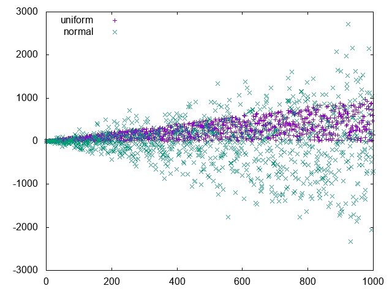

# Gnuplot Elixir

A simple interface from Elixir data structures to the [Gnuplot graphing utility][1] that uses [Erlang Ports][5] to transmit chart data from your application to Gnuplot. Datasets are streamed directly to STDIN without temporary files and you can plot 500K points in 20 seconds on a 2.2 GHz Intel Core i7.

This is a conversion of the [Clojure Gnuplot library][4] by [aphyr][2].

## Usage

The `plot` function takes two arguments:

* a list of commands (each of which is a list of terms)
* a list of datasets (not required when plotting functions)

Commands are lists of terms that normally start with an atom such as `:set`. They may be written as lists or [Word lists](https://elixir-lang.org/getting-started/sigils.html#word-lists) - the following lines are equivalent:

* `[:set, :xtics, :off]`
* `~w(set xtics off)a`

and both convert to `set xtics off`.

Strings are output inside double quotes, and charlists are output without modification:

```elixir
[:plot, 'sin(x)', :title, "Sine Wave"]
```

becomes: `plot sin(x) title "Sine Wave"`

A dataset is a list of points, each point is a list of numbers.

### Scatter plot with a single dataset

Lets compare the [rand functions](http://erlang.org/doc/man/rand.html):

```elixir
alias Gnuplot, as: G

dataset = for _ <- 0..1000, do: [:rand.uniform(), :rand.normal()]
G.plot([
  [:set, :title, "rand uniform vs normal"],
  [:plot, "-", :with, :points]
  ], [dataset])
```

Gnuplot will by default open a window containing your plot.


### PNG of two datasets

Write two datasets to a file:

```elixir
G.plot([
  [:set, :output, "/tmp/rand.png"]
  [:set, :title, "rand uniform vs normal"],
  [:set, :term, :png], 
  [:set, :key, :left, :top],
  [:plot,
    G.list(
      ["-", :title, "uniform", :with, :points],
      ["-", :title, "normal", :with, :points])]
  ], 
  [
        for(n <- 0..200, do: [n, n * :rand.uniform()]),
        for(n <- 0..200, do: [n, n * :rand.normal()])
  ])
```



NB We need a comma separated list for the `plot` command which is made with `G.list([...,...])`

### Plot functions without datasets

```elixir
G.plot([[:plot, 'sin(x)', :title, "Sine Wave"]])
```


```elixir
G.plot([
        ~w(set autoscale)a,
        ~w(set samples 800)a,
        [:plot, '[-30:20]', 'sin(x*20)*atan(x)']
])
```


## Installation

When [available in Hex](https://hex.pm/docs/publish), the package can be installed
by adding `gnuplot` to your list of dependencies in `mix.exs`:

```elixir
def deps do
  [
    {:gnuplot, "~> 0.19.70"}
  ]
end
```

Documentation can be generated with [ExDoc](https://github.com/elixir-lang/ex_doc)
and published on [HexDocs](https://hexdocs.pm). Once published, the docs can
be found at [https://hexdocs.pm/gnuplot](https://hexdocs.pm/gnuplot).

## Testing

Some tests create plots which require `gnuplot` to be installed. They can be be excluded with:

    mix test.watch --exclude gnuplot:true

## Performance

The performance of the library is comparable to the Clojure version when `gnuplot` plots to a GUI. It is a little faster when writing directly to a PNG. All times in milliseconds from cold starts of the VM:

| Points | Clojure GUI | Elixir GUI | Elixir PNG |
| -----: | ----------: | ---------: | ---------: |
|      1 |       1,487 |          5 |          2 |
|     10 |       1,397 |         10 |         10 |
|    1e2 |       1,400 |          4 |         49 |
|    1e3 |       1,381 |         59 |         40 |
|    1e4 |       1,440 |        939 |        349 |
|    1e5 |       5,784 |      5,801 |      4,091 |
|    1e6 |      49,275 |     43,464 |     41,521 |


```elixir
points      = [1, 10, 100, 1_000, 10_000, 100_000, 1_000_000]
clojure_gui = [1.487, 1.397, 1.400, 1.381, 1.440, 5.784, 49.275]
elixir_gui  = [0.005, 0.010, 0.004, 0.059, 0.939, 5.801, 43.464]
elixir_png  = [0.002, 0.010, 0.049, 0.040, 0.349, 4.091, 41.521]
datasets    = for ds <- [clojure_gui, elixir_gui, elixir_png], do: Enum.zip(points, ds)

G.plot([
  [:set, :title, "Render scatter plot"],
  [:set, :xlabel, "Points"],
  [:set, :ylabel, "Elapsed (s)"],
  ~w(set key left top)a,
  ~w(set logscale xy)a,
  ~w(set grid xtics ytics)a,
  ~w(set style line 1 lw 4 lc '#63b132')a,
  ~w(set style line 2 lw 4 lc '#421C52')a,
  ~w(set style line 3 lw 4 lc '#732C7B')a,
  [:plot, G.list(
      ["-", :title, "Clojure GUI", :with, :lines, :ls, 1],
      ["-", :title, "Elixir GUI",  :with, :lines, :ls, 2],
      ["-", :title, "Elixir PNG",  :with, :lines, :ls, 3]
  )]], datasets
])
```

## Credits and licence

Original design ©2015 [Kyle Kingsbury][2].

Elixir code ©2019 [DEVSTOPFIX LTD][3].

Distributed under the [Eclipse Public License v2][6].


[1]: http://www.gnuplot.info/
[2]: https://github.com/aphyr
[3]: http://www.devstopfix.com/
[4]: https://github.com/aphyr/gnuplot
[5]: http://erlang.org/doc/reference_manual/ports.html
[6]: https://www.eclipse.org/legal/epl-2.0/